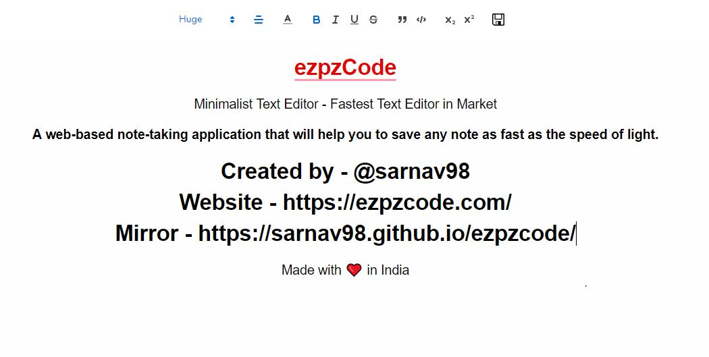

# ezpzcode

<h2> ezpzCode - Minimalist Text Editor - Fastest Text Editor in MARKET! </h2>

A web-based note-taking application that will help you to save any note as fast as the speed of light. 

> **Warning**: ezpzCode is in active development.

### Fastest Text editor in Market as of 2020

ezpzCode was made by developers for developers - a simple, plain text note taking application for everyone. What you see is what you paste. 

### Beautiful

Enjoy a beautiful, clean design reminiscent of your text editor.

### Author

- [Sarnav Dutta](https://github.com/sarnav98)

## License

This project is open source and available under the MIT License.

 

<h2 style="text-align: center;">Made with ❤️ in India</h2>

